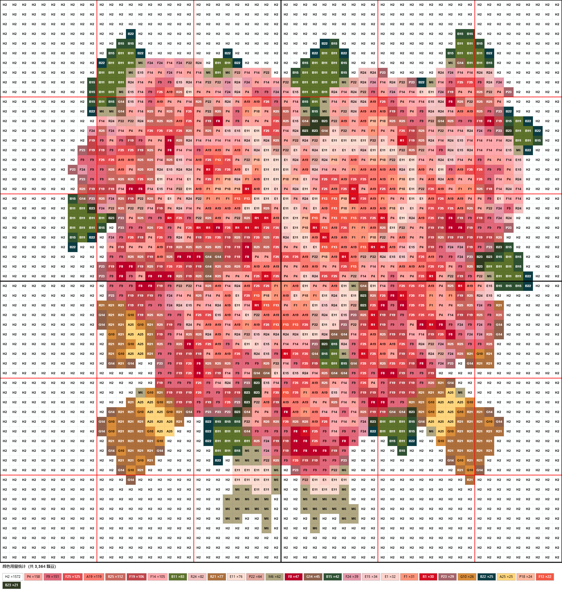

<div align="center">

# 🧩 拼豆图纸生成器

**上传图片，自动生成拼豆珠子排列图纸**

基于 CIE-Lab 色彩空间精准配色 · 支持 MARD 289 色色卡

[](https://www.python.org/)
[](https://flask.palletsprojects.com/)
[](LICENSE)

</div>

---

## 💡 关于这个项目

玩拼豆的时候想找个好看的图案照着拼。在小红书上翻了半天，要么图案不合适，要么像素太低糊成一团，好不容易找到个生成网站，生成图纸还要收费或者开会员。

就为了拼个豆开个会员？想了想还是自己写一个吧。

这是一个**本地运行**的拼豆图纸生成器，下载到电脑上就能用，完全免费，没有次数限制。把喜欢的图片丢进去，自动生成带色号标注的拼豆排列图纸，打印出来照着摆豆子就行。

功能该有的都有：精准配色、多板子拼接、定位线、逐格编辑、批量换色。项目不复杂，三行命令跑起来，不会部署的问问 AI 就行。

希望对你也有用，祝你们拼得开心 🧩

## ✨ 功能特性

| 功能 | 说明 |
|:---|:---|
| 🖼️ 图片转拼豆图纸 | 上传任意图片，自动像素化并映射到拼豆色卡 |
| 🎯 CIE-Lab 精准配色 | 感知均匀色彩空间，颜色匹配更准确 |
| 📐 多板子拼接 | 自动计算板子数量，拼接排列 |
| 🔴 10×10 定位线 | 红色粗线划分区域，方便定位 |
| 🎨 颜色容差 | 合并相近颜色，忽略羽化边缘噪点 |
| 🔢 最大颜色数 | 限制用色种类，简化图纸 |
| ✏️ 逐格编辑 | 选择色号后点击格子修改颜色 |
| 🔄 批量替换 | 一键将某个颜色全部替换为指定颜色 |
| 🔍 缩放查看 | 缩放滑块 25%~500% |
| 📥 导出 PNG | 可调分辨率、字体大小、包含内容 |

## 📸 效果展示

<table>
  <tr>
    <th>输入原图</th>
    <th>生成图纸（58×58，30px/格）</th>
  </tr>
  <tr>
    <td></td>
    <td></td>
  </tr>
</table>

## 🚀 快速开始

```bash
# 克隆项目
git clone https://github.com/Clyde323/pixel-beads-generator.git
cd pixel-beads-generator

# 安装依赖
pip install -r requirements.txt

# 启动服务
python app.py
```

打开浏览器访问 **http://localhost:5000**

## 📖 使用说明

### 基本流程

```
上传图片 → 设置板子规格 → 调节精密程度 → 颜色优化 → 生成图纸 → 编辑/导出
```

### 参数说明

| 参数 | 说明 | 默认值 |
|:---|:---|:---:|
| 板子规格 | 单块板子的格数（长×宽） | 29×29 |
| 精密程度 | 总分辨率，自动计算板子数量 | 29 |
| 颜色容差 | ΔE\* 值，合并相近颜色 | 2 |
| 最大颜色数 | 限制用色种类 | 不限 |

### 编辑模式

开启工具栏的 **✏️ 编辑** 开关后：

- **逐格编辑**：在色号栏选择画笔颜色，点击图纸中的格子即可修改
- **批量替换**：选择原色 → 目标色，点击"替换全部"一键替换

### 导出设置

点击 **📥 导出** 弹出设置弹窗：

- 单元格大小（10~50px）控制导出分辨率
- 色号字体大小（6~14px）
- 可选择是否包含：底色 / 网格线 / 色号 / 颜色统计

## 🎨 色卡数据

MARD 拼豆色卡数据来源：[pixel-beads.com](https://www.pixel-beads.com/zh/mard-bead-color-chart)

包含 **289 色**，覆盖 A~ZG 全系列色号。

## 🛠️ 技术栈

| 层级 | 技术 |
|:---|:---|
| 后端 | Python · Flask · Pillow · NumPy |
| 前端 | HTML · CSS · JavaScript · Canvas |
| 颜色算法 | CIE-Lab 色彩空间（RGB → XYZ → Lab） |

## 📁 项目结构

```
pixel-beads-generator/
├── app.py                      # Flask 后端
├── requirements.txt            # Python 依赖
├── README.md                   # 项目说明
├── LICENSE                     # MIT 许可证
├── static/
│   ├── css/style.css           # 样式
│   ├── js/app.js               # 前端逻辑
│   └── data/color_cards/
│       └── mard.json           # MARD 色卡（289色）
├── templates/
│   └── index.html              # 页面模板
└── docs/
    └── images/                 # 展示图片
```

## 📝 更新日志

### v1.0.0
- ✅ 图片转拼豆图纸核心功能
- ✅ CIE-Lab 颜色匹配算法
- ✅ 多板子拼接
- ✅ 10×10 定位线
- ✅ 逐格编辑 + 批量替换
- ✅ 可调导出参数
- ✅ 缩放滑块

## 📄 许可证

[MIT License](LICENSE)
